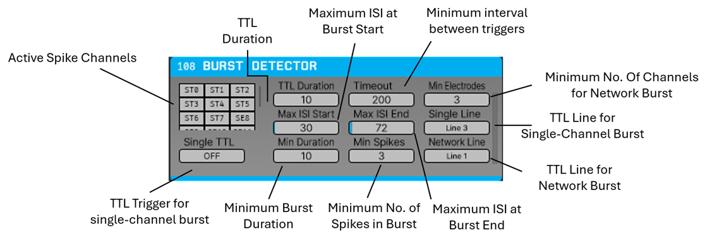

# Burst Detector



Neuronal bursts are periods of rapid, coordinated spiking activity that play fundamental roles in a variety of physiological processes, including information processing, synaptic plasticity, and network communication. In vitro, burst dynamics are widely used to characterize the functional state and development of neuronal cultures, assess pharmacological interventions, and investigate mechanisms underlying physiological and pathological activity. Real-time burst detection is therefore an important component of closed-loop electrophysiology experiments.

The Burst Detector plugin detects both **single-electrode bursts** and **network bursts** directly from spike trains using the **MaxInterval (MI)** burst detection algorithm ([Legéndy & Salcman, 1985](https://pubmed.ncbi.nlm.nih.gov/3998798/); [Cotterill et al., 2016](https://journals.physiology.org/doi/full/10.1152/jn.00093.2016)). Upon burst detection, the plugin emits user-configurable TTL events, enabling integration with closed-loop stimulation systems and external hardware.

This plugin aims to extend the applicability of the Open Ephys GUI to **in vitro electrophysiology**, providing an online burst detector suitable for multi-electrode array (MEA) recordings.

## Installation

This plugin will in the future be added via the Open Ephys GUI Plugin Installer. To access the Plugin Installer, press **ctrl-P** or **⌘P** from inside the GUI. Once the installer is loaded, browse to the "Burst Detector" plugin and click "Install."

## Usage


- Place the plugin anywhere downstream of a Spike Detector.

- Once spike channels (single electrodes, stereotrodes, or tetrodes) are available, corresponding toggle buttons will appear in the left panel. These can be enabled or disabled to include or exclude individual channels from burst detection.

- Set relevant burst detection parameters (**we recommend these are tuned to your experiment**), define TTL output lines, and toggle single-channel burst detection as intended.

### Parameters

* `TTL_DURATION` (ms) controls the duration of the TTL events triggered upon burst detection (default = 10 ms).

* `MAX_ISI_START` (ms) controls the maximum **inter-spike interval (ISI)** allowed between two consecutive spikes required to initiate a burst candidate (default = 30 ms).

* `MAX_ISI_END` (ms) controls the maximum **inter-spike interval (ISI)** allowed between consecutive spikes once a burst has been initiated (default = 50 ms).

* `MIN_DURATION` (ms) controls the minimum duration of a burst (default = 10 ms).

* `TIMEOUT` (ms) specifies the refractory period following a detected burst during which no additional burst events are emitted (default = 200 ms).

* `MIN_ELECTRODES` specifies the minimum number of simultaneously bursting electrodes required to classify an event as a **network burst** (default = 3).

* `SINGLE_LINE` controls the TTL Line of the single-channel burst triggers (default = 1).

* `NETWORK_LINE` controls the TTL line of the network burst trigger (default = 1).

* `SINGLE_TTL` (bool) controls whether to send TTL events for single-channel bursts (default = False).


## Building from source

First, follow the instructions on [this page](https://open-ephys.github.io/gui-docs/Developer-Guide/Compiling-the-GUI.html) to build the Open Ephys GUI.

**Important:** This plugin is intended for use with the latest version of the GUI (0.6.0 and higher). The GUI should be compiled from the [`main`](https://github.com/open-ephys/plugin-gui/tree/main) branch, rather than the former `master` branch.

Then, clone this repository into a directory at the same level as the `plugin-GUI`, e.g.:
 
```
Code
├── plugin-GUI
│   ├── Build
│   ├── Source
│   └── ...
├── OEPlugins
│   └── burst-detector
│       ├── Build
│       ├── Source
│       └── ...
```

### Windows

**Requirements:** [Visual Studio](https://visualstudio.microsoft.com/) and [CMake](https://cmake.org/install/)

From the `Build` directory, enter:

```bash
cmake -G "Visual Studio 17 2022" -A x64 ..
```

Next, launch Visual Studio and open the `OE_PLUGIN_burst-detector.sln` file that was just created. Select the appropriate configuration (Debug/Release) and build the solution.

Selecting the `INSTALL` project and manually building it will copy the `.dll` and any other required files into the GUI's `plugins` directory. The next time you launch the GUI from Visual Studio, the Crossing Detector plugin should be available.


### Linux

**Requirements:** [CMake](https://cmake.org/install/)

From the `Build` directory, enter:

```bash
cmake -G "Unix Makefiles" ..
cd Debug
make -j
make install
```

This will build the plugin and copy the `.so` file into the GUI's `plugins` directory. The next time you launch the compiled version of the GUI, the Burst Detector Detector plugin should be available.


### macOS

**Requirements:** [Xcode](https://developer.apple.com/xcode/) and [CMake](https://cmake.org/install/)

From the `Build` directory, enter:

```bash
cmake -G "Xcode" ..
```

Next, launch Xcode and open the `burst-detector.xcodeproj` file that now lives in the “Build” directory.

Running the `ALL_BUILD` scheme will compile the plugin; running the `INSTALL` scheme will install the `.bundle` file to `/Users/<username>/Library/Application Support/open-ephys/plugins-api`. The Burst Detector plugin should be available the next time you launch the GUI from Xcode.

## Attribution

The Burst Detector plugin was developed by **Pedro Félix Alves** and **Paulo Aguiar** at the **Neuroengineering and Computational Neuroscience Laboratory**, i3S – Instituto de Investigação e Inovação em Saúde, University of Porto.
For any inquiry about the plugin, you can contact [pauloaguiar@i3s.up.pt](mailto:pauloaguiar@i3s.up.pt).
